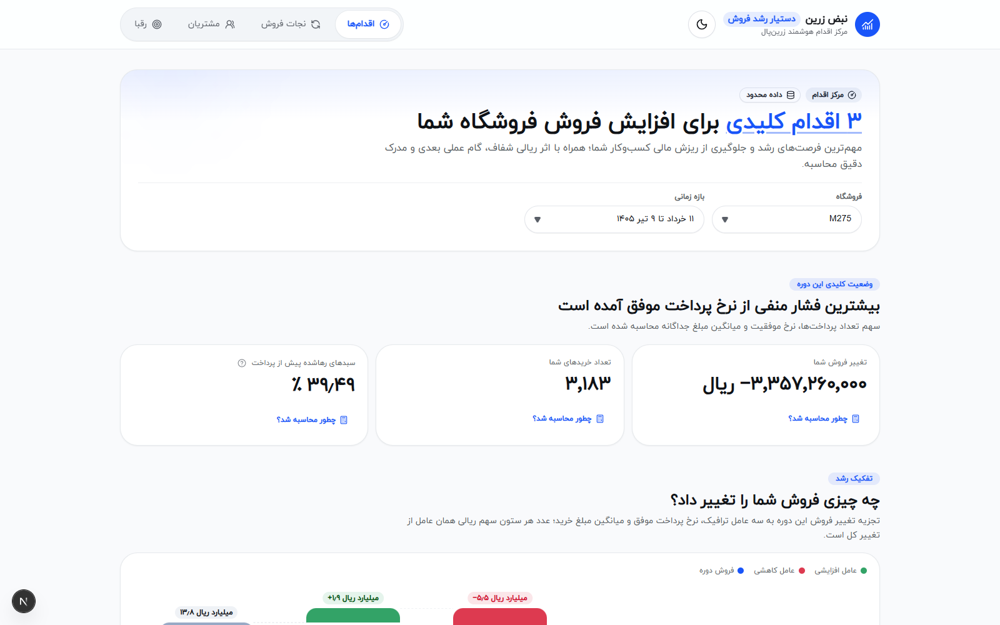

# نبض زرین — Zarin Pulse

> **مرکز اقدام تحلیلی برای پذیرندگان زرین‌پال (Action Center)** 
> 
> «نبض زرین» یک داشبورد نمودارمحور ساده نیست؛ ابزاری تصمیم‌ساز برای پذیرنده غیرتکنیکال است که مهم‌ترین فرصت‌های افزایش فروش و رشد کسب‌وکار را همراه با اثر ریالی شفاف، اقدام مشخص، سطح اطمینان و مدرک دقیق محاسبه ارائه می‌کند.



*مرکز اقدام: اولویت‌بندی ریالی فرصت‌ها، شاخص‌های کلیدی دوره و تفکیک عوامل تغییر فروش — همراه با کشوی «چطور محاسبه شد؟» برای هر عدد.*

---

## 🌟 ویژگی‌های کلیدی

* **مرکز اقدام اولویت‌دار (Action Center):** اولویت‌بندی خودکار ۳ فرصت برتر پذیرنده بر اساس اثر ریالی و سطح اطمینان آماری.
* **ردیابی و اثبات‌پذیری ۱۰۰٪ (Traceability & Evidence):** قابلیت باز کردن کشوی مدرک محاسبه (`Evidence Sheet`) برای تمامی شاخص‌ها شامل شناسه فرمول، صورت و مخرج کسر، ستون‌های منبع، فیلترها، فرضیات و سطرهای نمونه تراکنش.
* **تحلیل تفکیکی رشد (Growth Decomposition):** تفکیک تغییرات فروش به سه مؤلفه ترافیک (نشست‌ها)، نرخ تبدیل و اندازه سبد خرید.
* **نجات فروش و بازیابی تبدیل (Conversion Recovery):** تحلیل قیف ۴ مرحله‌ای پرداخت، تفکیک انصراف قبل از درگاه (`NoAttempt`)، خطایابی PSPها و پتانسیل بازیابی تلاش‌های مجدد (`Retry`).
* **رشد و وفاداری مشتریان (Customer Growth):** سنجش سهم خرید مجدد، تمرکز درآمد و ماتریس نگه‌داشت کوهورت (`Cohort Retention`) بر اساس کارت‌های ناشناس‌سازی‌شده.
* **مقایسه با گروه همتا (Peer Benchmark):** ارزیابی منصفانه جایگاه پذیرنده در میان رقبای هم‌صنف (کیف و کفش، خدمات آنلاین و...) و کشف پنجره‌های زمانی طلایی فروش.
* **طراحی بومی و استاندارد زرین‌پال:** رابط کاربری کاملاً راست‌چین (RTL)، تایپوگرافی با فونت رسمی ایران‌یکان (`IRANYekanXVF`)، مبالغ به ریال و تقویم رسمی هجری خورشیدی (شمسی).

---

## 🏗️ معماری و پشته فنی

* **Frontend:** Next.js 16 (App Router, Turbopack) + React 19 + TypeScript (Strict Mode)
* **Styling & UI:** Tailwind CSS 4 + shadcn/ui (Base Nova) + Lucide Icons
* **تایپوگرافی و تاریخ:** فونت ایران‌یکان + فرمت‌کننده بومی هجری خورشیدی (`Intl.DateTimeFormat("fa-IR-u-ca-persian")`)
* **موتور تحلیلی و پردازش:** Python 3.10+ و DuckDB برای پردازش سریع آفلاین میلیون‌ها سطر لاگ پرداخت
* **معماری بدون پایگاه‌داده (Runtime-agnostic):** اجرای آنی در مرورگر با مصرف مستقیم JSONهای سبک و فشرده‌شده از مسیر `public/analysis/`

---

## 🧭 مسیرهای سامانه

| مسیر | عنوان بخش | کاربرد و ارزش برای پذیرنده |
|---|---|---|
| `/` | **مرکز اقدام (Action Center)** | نمایش ۳ اقدام حیاتی، اولویت‌بندی ریالی و خلاصه شاخص‌های کلیدی عملکرد |
| `/recovery` | **نجات فروش (Conversion Recovery)** | تحلیل ریزش‌های قیف پرداخت، خطاهای PSP و سناریوی بازیافت فروش |
| `/customers` | **رشد مشتریان (Customer Growth)** | ماتریس کوهورت بازگشت خریداران، تکرار خرید و سهم مشتریان وفادار |
| `/opportunities` | **فرصت‌های همتا (Peer Opportunities)** | مقایسه با رقبای هم‌صنف، صدک جایگاه بازار و ساعات طلایی فروش |

---

## 🚀 راهنمای اجرای سریع (نسخه دمو)

برای اجرای پروژه با استفاده از داده‌های پیش‌محاسبه‌شده:

```bash
# نصب وابستگی‌ها
npm install

# اجرای محیط توسعه
npm run dev
```

سپس در مرورگر آدرس `http://localhost:3000` را باز کنید.

---

## 🔄 پردازش و اجرای پایپ‌لاین روی داده‌های خام یا جدید

این پروژه محدود به یک فایل خاص نیست و می‌تواند هر دیتاست تلاش پرداخت با ساختار استاندارد را تحلیل کند.

### ۱. نصب وابستگی‌های پایتون:
```bash
python -m pip install -r requirements-analytics.txt
```

### ۲. قرار دادن فایل CSV:
فایل داده‌ها را در مسیر `data/raw/challenge_data.csv` قرار دهید. (این فایل به دلایل محرمانگی در Git ذخیره نمی‌شود).

### ۳. اجرای اسکریپت‌های تحلیلی:
```bash
# ۱. تولید لایه بازیابی تبدیل
python -m analytics.conversion_recovery.build_artifact

# ۲. تولید لایه رشد و کوهورت مشتریان
python -m analytics.customer_growth.build_artifact

# ۳. تولید لایه فرصت‌های همتا و بنچ‌مارک
python -m analytics.peer_opportunities.pipeline

# ۴. تجمیع نهایی مرکز اقدام (Action Center)
python -m analytics.action_center \
  --feature public/analysis/conversion-recovery.json \
  --feature public/analysis/customer-growth.json \
  --feature public/analysis/peer-opportunities.json \
  --output public/analysis/action-center.json
```

---

## 🧪 تست و اعتبارسنجی کیفیت کد

```bash
# ۱. تست‌های واحد و یکپارچگی تحلیلی پایتون
python -m pytest analytics/tests -q

# ۲. تست‌های قرارداد و مدل فرانت‌اند (Node.js Test Runner)
node --test tests/unit/*.test.mjs

# ۳. اعتبارسنجی جامع پروژه (Lint + TypeScript Strict Typecheck + Next.js Production Build)
npm run verify
```

---

## 📂 ساختار پروژه

```text
├── analytics/                 # خط لوله تحلیلی و محاسبات DuckDB (پایتون)
│   ├── common/                # لودر اسکیما، تجمیع نشست‌ها و فرمول‌ها
│   ├── conversion_recovery/   # محاسبات قیف، NoAttempt و PSPها
│   ├── customer_growth/       # محاسبات تکرار خرید و ماتریس Cohort
│   └── peer_opportunities/    # تحلیل هم‌صنف، صدک‌ها و تقویم فرصت
├── public/
│   ├── analysis/              # آمار و Artifactهای سبک خروجی JSON
│   └── fonts/                 # فونت‌های رسمی ایران‌یکان
├── src/
│   ├── app/                   # روت‌ها و لایه‌بندی Next.js App Router
│   ├── components/            # کامپوننت‌های مشترک رابط کاربری و شل اصلی
│   ├── contracts/             # تعاریف تایپ‌های مشترک و اعتبارسنجی اسکیما
│   ├── entities/              # مدل‌های داده و کامپوننت‌های مشترک (Evidence Drawer، کارت‌ها)
│   ├── features/              # صفحات و کامپوننت‌های اختصاصی هر بخش تحلیلی
│   └── lib/                   # ابزارهای کمکی (تبدیل تقویم شمسی، کلاس‌ها و استایل‌ها)
└── tests/                     # تست‌های واحد و E2E
```

---

## 🎨 بهبودهای تجربه کاربری این نسخه

تمام تغییرات زیر روی داده واقعی اعتبارسنجی شده‌اند (پروب CDP در عرض‌های 320 تا 1440 پیکسل) و منطق تحلیلی برنامه دست‌خورده باقی مانده است.

### سیستم موشن و حس زنده بودن (Motion System)
* **بنیان حرکتی مبتنی بر توکن:** مجموعه‌ای از انیمیشن‌های ورود (`rise-in`، `pop-in`، `fade-in`، رشد میله‌ای) با منحنی نرم iOS (`--ease-smooth`) و اورشوت فنری ملایم برای نمودارها در `globals.css` متمرکز شده است.
* **سیاست هوشمند `prefers-reduced-motion`:** به‌جای خفه‌کردن کامل انیمیشن‌ها (که سایت را برای کاربران با تنظیم «خاموش» ویندوز کاملاً مرده نشان می‌داد)، حرکت‌های بزرگ حذف و فقط فیدهای ظریف حفظ می‌شوند — مطابق HIG اپل.
* **ورود پلکانی بخش‌ها:** قهرمان صفحه، کارت‌های KPI، کارت‌های اقدام و نمودارها (آبشاری، قیف، کوهورت، بنچ‌مارک رقبا) با تأخیر پلکانی و ترتیب روایی وارد می‌شوند.
* **شمارش اعداد (Count-up):** مبالغ و درصدهای KPI و اثر ریالی اقدام‌ها از صفر تا مقدار نهایی با easing نرم شمرده می‌شوند؛ بدون state اضافه در React و با نمایش فوری مقدار نهایی در SSR و حالت reduced-motion.
* **باز/بسته شدن نرم پنل مدرک و دراپ‌داون‌ها:** شیت «چطور محاسبه شد؟» با اسلاید+فید ۴۲۰ms باز و ۲۶۰ms بسته می‌شود و محتوای داخل آن (نتیجه، هشدارها، مقایسه، جزئیات فنی) کَسکیدی بالا می‌آید؛ دراپ‌داون‌های انتخابگر با زوم و فید نرم باز می‌شوند.
* **ترنزیشن بین صفحات:** هر مسیر با ورود نرم rise+fade نمایش داده می‌شود (`app/template.tsx`).
* **میکرواینترکشن‌ها:** تعویض چرخشی آیکون خورشید/ماه در تغییر تم، فیدبک لمسی و pop آیکون تب فعال در ناوبر موبایل، و اسکلتون‌های شیمری به‌جای pulse.

### متن، محتوا و شفافیت
* **فارسی‌سازی کامل کشوهای مدرک:** حذف تمام عبارات انگلیسی و اصطلاحات آماری از بخش «بررسی بیشتر» هر ۲۸ کشو (فیلترها، فرضیات، محدودیت‌ها و یادداشت کیفیت داده) در هر ۴ فایل تحلیل.
* **تبدیل تاریخ‌ها به تقویم شمسی:** مقادیر فیلتر تاریخی ISO به‌صورت خودکار با `formatPersianDate` نمایش داده می‌شوند.
* **بازنویسی غیرفنی «روش محاسبه»:** عنوان‌ها، فرمول‌ها و توضیحات ۶ شاخص انصراف/تلاش مجدد برای پذیرنده غیرتکنیکال ساده شدند.

### نمودار قیف تعاملی (صفحه نجات فروش)
* **Funnel Overview جدید:** نوارهای افقی وسط‌چین با عرض متناسب با تعداد هر مرحله، طیف رنگی primary، نرخ عبور فارسی بین مراحل و Badge قرمز «بیشترین ریزش» روی پله اصلی.
* **کلیک‌پذیری:** کلیک روی هر پله، کشوی مدرک همان مرحله را باز می‌کند.

### رنگ معنایی سبز/قرمز (Semantic Status Coloring)
قاعده یکسان در همه صفحات: رنگ هرگز تنها حامل معنا نیست (همراه آیکون/متن)، و نبودِ مبنا یا نمونه کافی همیشه خنثی رندر می‌شود.

| صفحه | عنصر | قاعده رنگ |
|---|---|---|
| مرکز اقدام | کارت KPI | افزایش سبز / کاهش قرمز بر اساس علامت `change` |
| مرکز اقدام | کارت‌های اقدام ۲ و ۳ | سبز برای «فرصت رشد»، قرمز برای «نیازمند توجه» |
| مرکز اقدام | عدد اثر ریالی/درصدی | منفی: قرمز با آیکون روند نزولی؛ مثبت: سبز |
| نجات فروش | ردیف بازه مبلغی هر PSP | زیر میانگین بازار قرمز / بالاتر یا مساوی سبز |
| مشتریان | کارت خریداران بازگشتی | مقایسه با درصد دوره قبل |
| مشتریان | سلول‌های صفر٪ کوهورت | قرمز (ماه سپری‌شده بدون هیچ بازگشت) |
| رقبا | کارت‌های تفکیک عامل‌ها | سهم مثبت سبز / منفی قرمز |
| رقبا | جایگاه بازار | مقدار بالاتر از میانه صنف سبز / پایین‌تر قرمز |
| رقبا | ساعات طلایی | lift بالاتر از مبنا سبز / پایین‌تر قرمز |

### تجربه موبایل و ریسپانسیو
* **ناوبر شیشه‌ای شناور (Glassmorphism):** تب‌بار پایین موبایل با z-index بالا (z50)، گوشه‌های گرد قابل توجه، فاصله از لبه‌های صفحه، پس‌زمینه نیمه‌شفاف با `backdrop-blur` — سازگار با تم روشن و تاریک.
* **رفع سرریز عرض ۱۰۲۴–۱۲۷۹:** نام بازه‌های مبلغی («میانی پایین» و...) دیگر در کارت‌های PSP نیمه‌عرض بریده نمی‌شوند.
* **انتخاب فروشگاه همیشه رو به پایین:** کشوی فروشگاه در صفحه مشتریان با محدودسازی ارتفاع به فضای زیر تریگر، دیگر به بالا flip نمی‌کند.

---

## 📜 مستندات تکمیلی

* `AGENTS.md` — قوانین مخزن، قراردادهای داده و مرزهای مالکیت فایل‌ها
* `DESIGN.md` — راهنمای جامع طراحی بصری، توکن‌ها و هویت برند زرین‌پال
* `contracts.md` — قراردادهای داده‌ای بین موتور تحلیلی و لایه نمایش
* `context/project-overview.md` — تشریح مسئله، نیازمندی‌ها و سناریوی کاربر طلایی
* `context/dataset-profile.md` — مشخصات آماری و توزیع داده‌های خام
